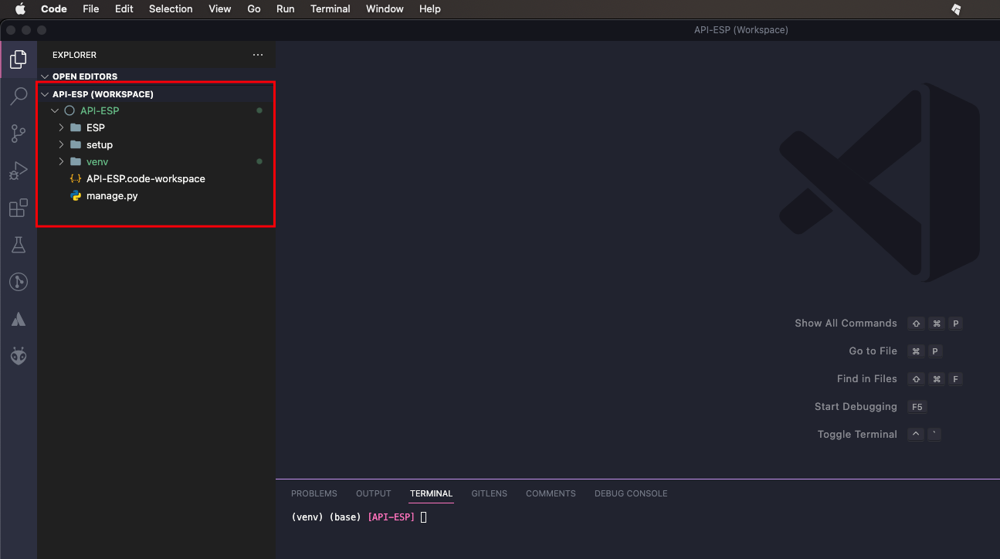

# Universidade Federal Fluminense - UFF
## Autor : Márcio Garrido
### marciogarrido@id.uff.br

## API para consumo de dados de microntroladores ESP

### Documentação Django
https://docs.djangoproject.com/en/4.0/

### Documentação Python

https://www.python.org/doc/

Instale a versão atualizada do Python na sua máquina caso nao tenha.
## Instalando Python

        pip install Python 3.7.4

## Criando Ambientes de desenvolvimento
Para garantirmos que a versão do seu projeto não conflite com outros apps, o recomendado é criar ambientes isolados.
Para criar, há a parte "Creating virtual environments". Para organizar o projeto, crie um diretório e em sequencia vá para o local criado.

        mkdir -p ~/Users/marciogarrido/API-ESP
        cd ~/Users/marciogarrido/API-ESP

Com local já identificado, o próximo passo é virtualizar o ambiente de desenvolimento venv

        python3 -m venv ./venv

No decorrer da aplicação, editamos e alteramos o código usando o Visual Studio Code, mas outros editores como PyCharm, Sublime Text ou Atom também são eficientes. 

Abrindo-o, acessamos a pasta "aplicacao > venv" e abrimos o terminal com "Command + J". Na janela "Terminal", precisamos carregar o ambiente virtual digitando pwd para copiar e colar o caminho após escrever source na linha seguinte. 

        pwd
        /Users/marciogarrido/API-ESP

No meu caso, o retorno do comando pwd foi o meu perfil, que vai variar de acordo com as suas credenciais. Com seu perfil identificado, o próximo passo é criar de fato o ambiente. Escrevemos /venv/bin/activate na sequência do caminho para acessar a pasta e inicializar com "Enter". Temos confirmação quando aparece (venv) antes do diretório.

         source /Users/marciogarrido/API-ESP/venv/bin/activate

Para validar se o processo foi concluído com sucesso, seu terminal agora deve ter o nome venv no início do texto como abaixo:

        (venv) (base) [API-ESP]  

# Instalando Django
Abra seu terminal e digite a instrução abaixo:

        pip install Django==4.0.5

Para verificação se o Djanjo foi instalado, execute o comando abaixo para ver as versões do seu ambiente

        pip pip freeze
    
O resultado deve retornar os modelos abaixo:

        asgiref==3.5.2
        Django==4.0.5
        sqlparse==0.4.2
# Instalando Django REST Framework 
Para seja possível consumir a API se faz necessário ter o framework REST.

        pip install djangorestframework
        pip install markdown       
        pip install django-filter 

### A documentacão Django REST Framework pode ser consultada em :
https://www.django-rest-framework.org

# Instalando suporte a banco de PostgreSQL

O banco de dados utilizado nesse projeto é o banco relacional PostgreSQL.exit

        pip install psycopg2

# Configurando o projeto e criando o APP API 

Com nosso ambiente virtual configurado e ativado, podemos dar início ao nosso projeto.
Para descobrir o comando de Django que executa e inicializa o projeto, escrevemos django-admin help na janela de terminal dentro do Visual Studio para visualizar uma série de comandos que podemos usar; dentre estes, existe o startproject.

        django-admin startproject setup . 
    
Para criar o primeiro projeto (módulo) devemos inciar o comando abaixo:

        python manage.py startapp Device

O resultado do seu ambiente configurado deve ser :

Subindo projeto para o Heroku

## Criar arquivo de dependencias 

        pip3 freeze > requirements.txt

## Salvar e subir

        heroku buildpacks:set heroku/python
        git add .
        git commit -m "add requirements.txt"
        git push heroku main

## Atualizar tabelas no Heroku

        heroku run python manage.py migrate

## Criar super usuários

        heroku run python manage.py createsuperuser